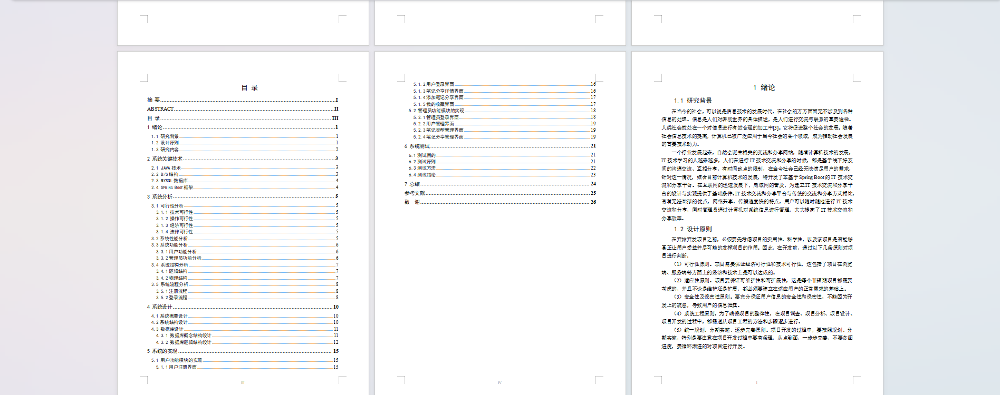

基于SpringBoot的IT技术交流和分享平台（程序+论文）
=
- 完整代码获取地址：从戎源码网 ([https://armycodes.com/](https://armycodes.com/))
- 作者微信：19941326836  QQ：952045282 
- 承接计算机毕业设计、Java毕业设计、Python毕业设计、深度学习、机器学习
- 选题+开题报告+任务书+程序定制+安装调试+论文+答辩ppt 一条龙服务

一、项目介绍
---
基于Spring Boot框架实现的IT技术交流和分享平台，系统包含两种角色：用户、管理员，系统分为前台和后台两大模块，主要功能如下：

### 1 用户功能模块的实现

系统前台主界面  
用户在系统前台可查看系统信息，展示整体系统功能和布局。

用户注册界面  
没有账号的用户可在注册界面进行注册操作，输入必要的信息完成账号创建。

用户登录界面  
用户在登录界面输入登录信息，点击登录按钮进行系统登录。

笔记分享详情界面  
用户可选择笔记分享查看详细信息，了解具体内容和相关评论。

添加笔记分享界面  
用户登录后可在此界面添加新的笔记分享信息，发布自己的笔记内容。

我的收藏界面  
用户可在此界面管理个人收藏的笔记分享信息，查看和删除收藏的内容。

### 2 管理员功能模块的实现

管理员登录界面  
管理员需通过登录界面进入系统后台，进行系统管理操作。

用户管理界面  
管理员在用户管理界面可查看所有用户信息，并对其进行编辑和删除操作。

笔记类型管理界面  
管理员可在此界面对笔记类型信息进行增删改查操作，管理笔记分类。

笔记分享管理界面  
管理员可在此界面对笔记分享信息进行增删改查操作，管理用户发布的笔记内容。

二、项目技术
---
- 编程语言：Java
- 数据库：MySQL
- 项目管理工具：Maven
- 前端技术：VUE、HTML、Jquery、Bootstrap
- 后端技术：Spring、SpringMVC、MyBatis

三、运行环境
---
- 操作系统：Windows、macOS都可以
- JDK版本：JDK1.8以上都可以
- 开发工具：IDEA、Ecplise、Myecplise都可以
- 数据库: MySQL5.7以上都可以
- Tomcat：任意版本都可以
- Maven：任意版本都可以

四、运行截图
---
### 论文截图：

### 程序截图：

